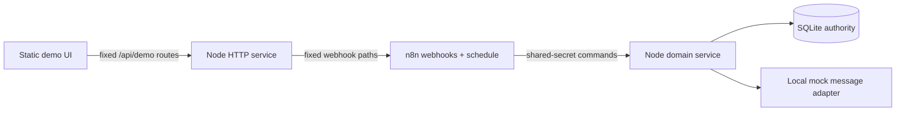

# Reusable local business-automation demo

A real local vertical slice turns simulated marine inquiries into durable leads and follow-up actions. n8n supplies real webhook and schedule orchestration. A zero-dependency Node TypeScript service owns all business behavior. SQLite is authoritative. Mock messaging terminates locally.

> **Unofficial demonstration based solely on publicly available information and simulated operational data. Not affiliated with or commissioned by Coastal Flow Marine.**

## Problem and running system

Unstructured inquiries require repetitive checks, routing, and follow-up. This demo proves a reusable transparent path without pretending to know private policy. The browser calls fixed same-origin endpoints. The Node service proxies only three fixed n8n webhooks. n8n calls secret-protected internal commands, visibly routes intake state, and responds. Node validates, normalizes, interprets, persists, claims, cancels, executes, and traces.



Deterministic rules are correct here because the demonstration needs repeatable, explainable evidence. AI would add uncertainty without a confirmed semantic requirement. `InquiryInterpreter` provides a narrow future seam; see [primitives](docs/primitives.md).

## Setup, run, stop, reset, verify

Prerequisites: Node 26+, Docker Desktop/Compose, curl. Do not run `npm install`; there are no dependencies.

```bash
./scripts/setup.sh                # creates .env with a random secret when absent; starts n8n
./scripts/start.sh                # foreground Node service; open http://127.0.0.1:18787
npm run verify                    # while both services run
./scripts/stop.sh
```

Reset through the confirmed UI control, or `./scripts/reset.sh` while Node runs. A clean run is `./scripts/stop.sh --volumes`, remove ignored `data/`, then repeat setup/start. Runtime state stays in ignored `data/` and the Compose `n8n_data` volume.

The Node service and n8n published port bind to loopback. Docker Desktop n8n reaches the loopback-bound host service through `host.docker.internal`. All `/internal/*` routes require the shared secret and have a 64 KiB body limit. This is local-demo isolation, not production authentication.

## Workflows

Stable source exports live in `n8n/workflows/`:

1. `coastal-intake-v1`: webhook → internal intake → visible Switch for ready, needs information, human, duplicate/fallback → response.
2. `coastal-followup-schedule-v1`: every minute → atomic claim and local execution command.
3. `coastal-followup-run-v1`: run-now webhook → the same claim/execution command → response.
4. `coastal-customer-update-v1`: update webhook → state update/cancel command → response.

Human handoff remains an intake branch because it is one domain outcome, not an independently triggered process. The startup entrypoint imports stable IDs and activates all workflows. Re-import updates the same IDs rather than creating intended duplicates.

## Persistence and safety

Migration `db/migrations/001_initial.sql` creates foreign keys, schema version 1, and unique inquiry/follow-up keys. An identical `(prospect slug, external event ID)` replays one lead and creates no extra action/message. A changed payload under that key returns a conflict. Follow-ups move `PENDING → CLAIMED → EXECUTED|FAILED`; safe pending/claimed work can become `CANCELED`. Claims use `BEGIN IMMEDIATE`. Execution rechecks lead validity before the synchronous mock send, and a canceled claim cannot record a late completion. Customer information is accepted only for a `NEEDS_INFORMATION` lead with an active request-information action; emergency and already-ready leads reject that transition without mutation. The accelerated 15-second example policy is visibly labeled and `due_at` remains durable.

## Real, mocked, unknown

- **REAL:** local n8n execution, deterministic Node rules, SQLite persistence, idempotency, claims, cancellation, trace.
- **MOCKED:** all people, organizations, contact details, inquiries, policy, and message delivery. `DEMO_FAIL_MESSAGE` is explicit demo-only failure injection.
- **UNKNOWN:** actual CRM/channel, pricing, feasibility, availability, response policy, sales stages, and handoff owner.

`PROSPECT_SLUG` selects one validated server-side prospect. The client cannot choose the prospect. Safe scenario APIs expose only configured fixture IDs. `prospect.json` keeps the publicly sourced service taxonomy in `PUBLICLY_VERIFIED`; keyword mappings and all operational rules remain `EXAMPLE_SIMULATED`. `PROSPECT_CONFIRMATION_REQUIRED` records discovery gaps. Markdown under `knowledge/` is Obsidian-compatible human-maintained context, never transactional state. No runtime knowledge lookup is implemented because current deterministic rules do not need one.

## Directory map

- `src/domain`, `interpreters`, `service`, `store`, `messaging`, `http` — reusable Node system
- `db/migrations` — ordered SQLite schema
- `n8n/workflows`, `compose.yaml` — orchestration and pinned runtime
- `prospects/coastal-flow-marine` — config, fixtures, human knowledge
- `public` — presentation shell using real workflows
- `tests` — behavior and persistence regression suite
- `docs/primitives.md` — actual reusable contracts

Create only the proven minimum prospect contract:

```bash
npm run new-demo -- --slug=serenity-spa
```

It rejects invalid/existing slugs and creates a minimum runnable contract: config with `demoScenarios`, one clearly synthetic fixture, and a knowledge README. Select it by changing `PROSPECT_SLUG`; generic UI code needs no edit.

## Reusability classification

- **GENERIC/REUSABLE:** HTTP boundary, SQLite schema/transactions, idempotency, scheduled action lifecycle, traces, mock adapter, n8n trigger/command shape.
- **INDUSTRY-SPECIFIC:** intake vocabulary and candidate fields.
- **COASTAL-FLOW-SPECIFIC:** public marine service labels and sources, simulated keyword mappings, and presentation language.
- **DEMO-ONLY:** 15-second policy, fixtures, reset, failure marker, mock delivery.

For a spa, real-estate agent, contractor, law firm, or service business, reuse the generic runtime and replace the prospect contract, fixtures, knowledge, approved classifications, required fields, urgent rules, and handoff policy. Do not infer those decisions.

## Demo narratives

### 30-second version

| Step | What to show | What to say | Do not explain unless asked |
|---|---|---|---|
| 1 | Before → After and boundary legend | “Today, someone reads, classifies, copies, and remembers. Here, the inquiry itself starts a real local workflow. The inquiry and delivery are simulated.” | Docker, node versions, SQLite tables |
| 2 | Select **Incomplete**; point to Rules and Missing information | “n8n invokes deterministic rules configured for this example. The system shows what matched and what is still missing.” | Keyword implementation |
| 3 | Persisted lead and pending follow-up | “It stores one durable next action instead of relying on memory. These are example rules and sample data; the structure is configurable to the real business.” | Workflow import mechanics |

### 60-second version

| Step | What to show | What to say | Do not explain unless asked |
|---|---|---|---|
| 1 | Disclaimer, boundaries, and Before → After | “This is unofficial, uses public business context, and connects to no prospect system.” | Container networking |
| 2 | Select **Incomplete** | “The real local webhook validates the inquiry, classifies the service, and identifies the missing phone, photos, and site access.” | TypeScript syntax |
| 3 | Follow-up and execution history | “SQLite stores the lead and a due follow-up. n8n handles when the next workflow runs; Node owns what the rule means.” | SQL schema |
| 4 | Select **Resubmit same event** | “A duplicate replays the existing result. It does not create another lead, follow-up, or message.” | Hash algorithm |
| 5 | Select **Mark information received**, then **Run scheduler now** | “When customer state changes, the old follow-up is canceled. The scheduler finds nothing valid to execute.” | Claim leases unless asked about reliability |

### 2-minute technical version

| Step | What to show | What to say | Do not explain unless asked |
|---|---|---|---|
| 1 | Architecture diagram in this README, then the UI | “The browser enters through fixed n8n webhooks. n8n orchestrates. The Node service owns deterministic rules and transitions. SQLite owns transactional state.” | Production scaling |
| 2 | Select **Complete routine** | “A complete pile-guide inquiry becomes intake-ready with its public service category and simulated matching rule shown separately.” | Hypothetical CRM mapping |
| 3 | Reset; select **Incomplete**; wait 15 seconds; run scheduler | “Missing information creates a real due action. The run-now webhook claims it once, terminates at the mock adapter, and records a simulated message event.” | Actual email providers |
| 4 | Refresh the page | “The lead, action status, and persistent execution history survive refresh because the browser is not the state owner.” | SQLite internals |
| 5 | Reset; select **Incomplete**; mark information received; run scheduler | “A valid state change cancels obsolete work. The scheduler cannot send it later.” | Transaction statements |
| 6 | Select **Emergency handoff** | “Example urgency terms force a human-owned route. No follow-up is scheduled, and the update action is not valid for this state.” | Imagined emergency policy |
| 7 | Reset; select **Mock failure**; after 15 seconds run scheduler | “A failed boundary becomes durable evidence instead of an assumed success. Nothing leaves the machine.” | Retry infrastructure not built here |

Never show or claim a real send, CRM write, private access, prospect approval, availability, price, feasibility, AI capability, or production readiness.

## Production bridge and limitations

Discovery must confirm source contracts, fields, retention/privacy, urgent procedure, owners, response policy, and adapters. Production needs authenticated network boundaries, least privilege, reconciliation, retries, monitoring, backups, secret management, and approved messages. This local demo has one process, one SQLite file, local shared-secret trust, simple phrase matching, no account model, and no actual external adapter.

## Portfolio / LinkedIn readiness

Appropriate claim: “Built a local reusable automation demo with n8n orchestration, a Node-owned deterministic domain layer, SQLite idempotency/state transitions, and simulated delivery.” Include the disclaimer. Avoid performance, customer-impact, affiliation, AI, or production claims.
